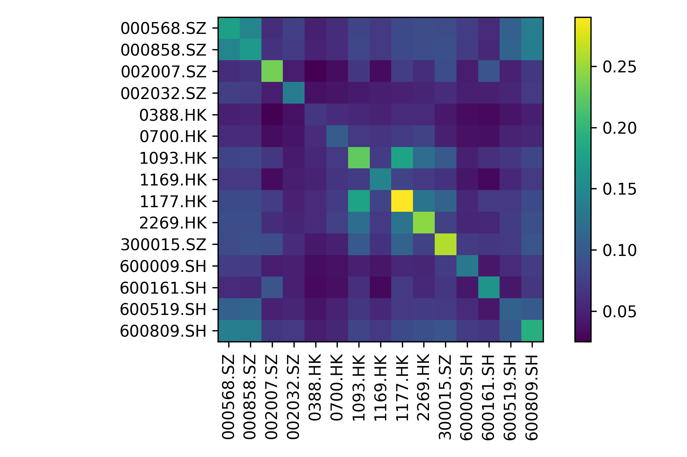
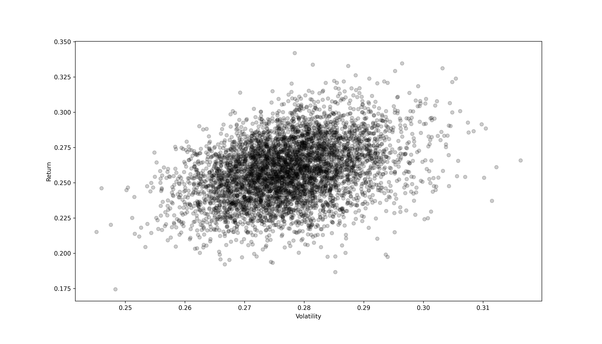

# Sysu-RiskManagement
Project resources:

- [x] code: 源代码（jupyter notebook格式）
- [x] data: 原始数据与预处理后的数据
- [x] pics: 输出的图片（用于报告等）
- [x] docs: 项目要求及其他资料

另外，项目基于[PyPortfolioOpt](https://github.com/robertmartin8/PyPortfolioOpt)实现，很好用的一个库。

## 资产收益率与相关矩阵

## MC模拟: 随机投资组合

## 建模：15个股票

### 不允许卖空

### 允许卖空

## 建模：15个股票+无风险资产
TODO
